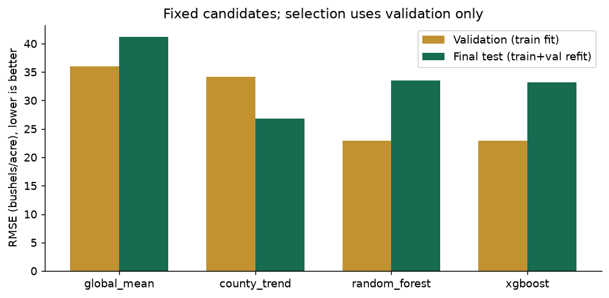
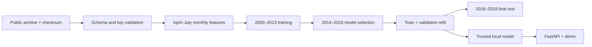
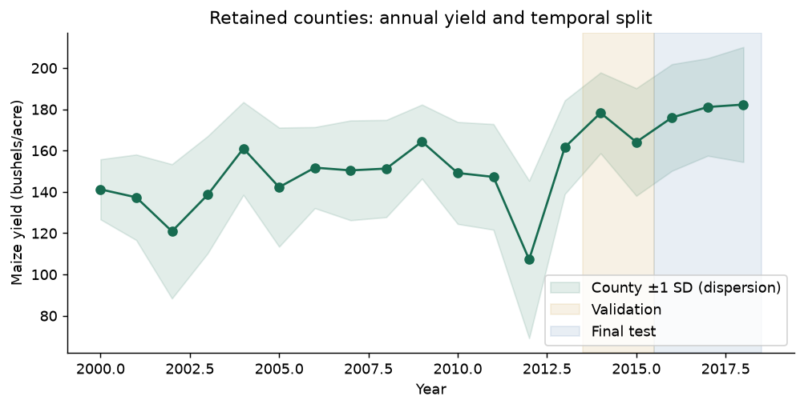
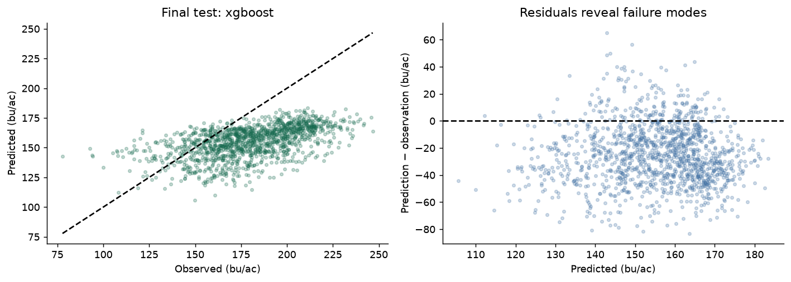
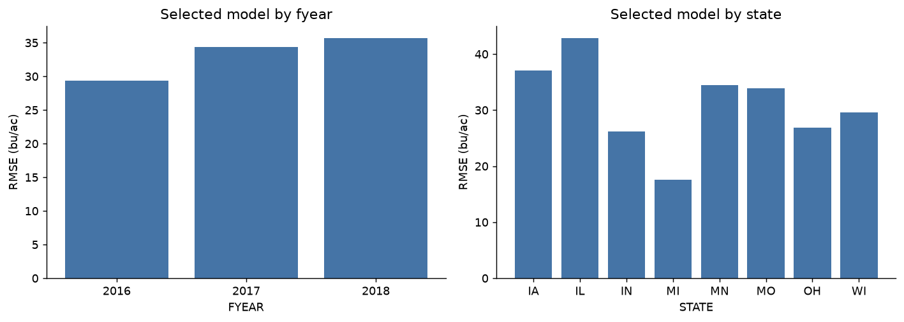
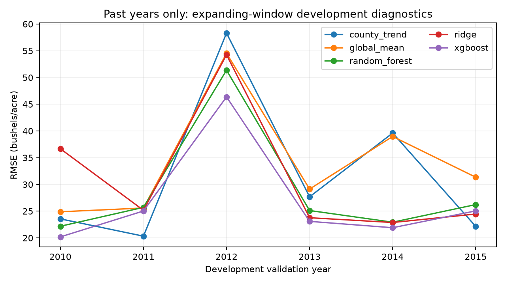
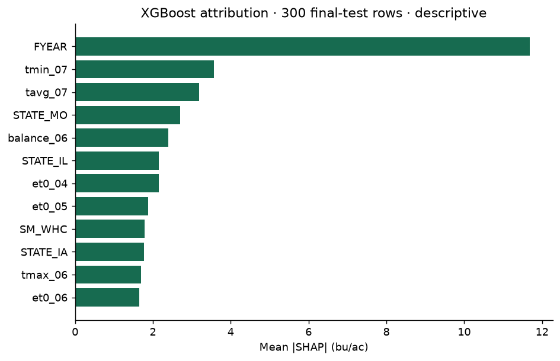
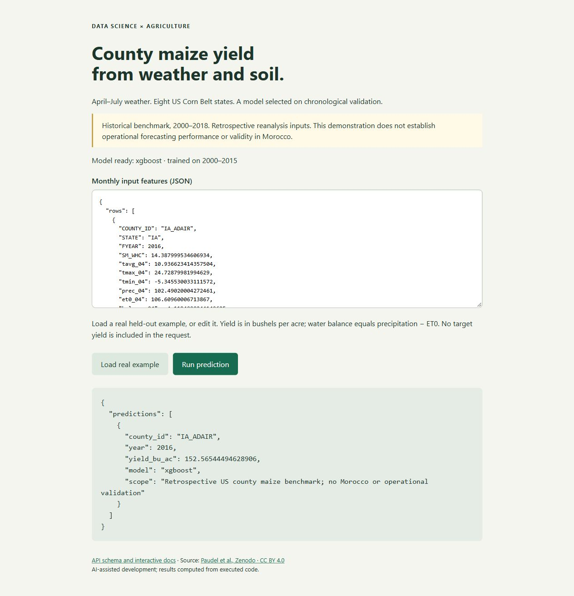

# Crop Yield Prediction

An agricultural ML benchmark that tests whether July weather and soil features predict future US county maize yields better than historical baselines.

**Main finding:** xgboost wins validation, then underperforms the county-trend baseline on 2016–2018. Its final-test RMSE is **33.21 bushels/acre**, with R² **-0.650**. This repository documents that failure openly and ships a reproducible pipeline and local inference demonstration. It does not claim a production-ready forecasting model.



## Problem

Yield estimation supports agricultural planning. An apparently strong model can fail on later years when yield trends change. A random split hides this risk by mixing years. This project makes that temporal challenge explicit at county scale, not farm scale.

## Objective

Predict annual maize yield using weather from April through July and soil capacity. Compare fixed baselines, Random Forest and XGBoost, select on chronological validation, and retain a later test period. Preserve data provenance, model limitations and executable evidence.

## Dataset

- Authors: Dilli Paudel, Allard de Wit and Hendrik Boogaard, Wageningen University & Research.
- [Official dataset and licence](https://zenodo.org/records/7751191) · [DOI 10.5281/zenodo.7751191](https://doi.org/10.5281/zenodo.7751191) · CC BY 4.0.
- USDA/NASS yields, Copernicus agrometeorological reanalysis, WISE soil water holding capacity. Three CSVs extracted from a 50.1 MB archive whose MD5 is checked.
- Study: **9,524 county-year observations**, **528 counties**, eight states (IA, IL, IN, OH, MN, WI, MI, MO), 2000–2018.
- **2,541** selected labels excluded without a soil match; remaining weather is complete. No target imputation. See [data provenance and units](data/README.md) and [data audit](reports/data-audit.json).
- The authors' dataset preparation is credited; no original dataset collection is claimed.

## Architecture / Workflow



## Exploratory Data Analysis



Annual means and dispersion show both long-term yield growth and interannual variation. The retained counties are a coverage subset, not a complete census. [Executed notebook](notebooks/01_analysis.ipynb) reviews the data audit, actual metric tables and test predictions.

## Modeling

Training: **7,186 rows** (2000–2013). Validation: **947 rows** (2014–2015). Test: **1,391 rows** (2016–2018). Counties recur across years: this tests future years in known counties, not unseen geographic regions.

- Global mean: a minimum sanity-check baseline.
- County trend: training-only linear time trend per county, with a global fallback for unseen counties.
- Random Forest: 160 trees, depth 12, minimum leaf size 4.
- XGBoost: 240 trees, depth 4, learning rate 0.05. Parameters fixed before test; no test-driven search.
- Tree inputs: year, soil capacity, state encoding and 24 monthly weather features. Neither target yield nor county identifiers enter the tree feature matrix. State encoding/imputation is fit on training only.
- Monthly precipitation/ET0 are totals, temperature mean is calendar-duration weighted, extrema are max/min, and water balance is precipitation minus ET0. **No post-July weather**, smoothed FAPAR, harvested area or crop-model yield surrogate enters training.

## Results

Actual executed metrics. Validation models use training only; final-test models are refit on training+validation. RMSE and MAE are in bushels/acre; lower is better. R² compares against the evaluation-set mean and can be negative.

| Model | Validation RMSE | Final-test RMSE | Final-test MAE | Final-test R² |
|---|---:|---:|---:|---:|
| global_mean | 35.98 | 41.22 | 35.16 | -1.542 |
| county_trend | 34.13 | 26.79 | 22.07 | -0.073 |
| random_forest | 22.90 | 33.51 | 28.86 | -0.680 |
| xgboost | 22.88 | 33.21 | 28.27 | -0.650 |

**Selection remains xgboost**, chosen by validation RMSE. We do not silently replace it with the test winner. The county-trend model performs better on final test, and all candidates have negative test R². Weather XGBoost validation RMSE is 22.88, versus 24.88 without weather. This limited validation ablation does not establish a durable or causal weather benefit.

The selected model's descriptive year-bootstrap RMSE range is 29.32–35.71. Only three year clusters exist: this interval is fragile, does not capture all spatial dependence, and is not a calibrated prediction interval.




Evidence: [metrics, versions and hashes](reports/metrics.json), [all held-out predictions](reports/test_predictions.csv), [group metrics](reports/group_metrics.csv). The original protocol and final-test results are retained; additional development must use a new evaluation protocol and an untouched future/geographic test set.

## Expanding-window development diagnostics

A retrospective check now compares five fixed models over six annual folds (2010–2015). Each fold trains only on 2000 through the previous year. Median imputation, state encoding and Ridge scaling are fit within that training fold. Ridge (alpha 10) adds a linear comparison; it has no claimed final-test score.

| Model | Pooled development RMSE | MAE | R² |
|---|---:|---:|---:|
| county_trend | 34.74 | 26.20 | 0.007 |
| global_mean | 35.63 | 28.20 | -0.044 |
| random_forest | 30.75 | 23.49 | 0.222 |
| ridge | 33.44 | 25.63 | 0.080 |
| xgboost | 28.43 | 21.82 | 0.335 |



These are pooled errors from actual out-of-year predictions, not averages of annual R². They are development diagnostics on already available data. The original 2016–2018 test and selected model stay as published; this is **not a new untouched evaluation**. XGBoost's development advantage does not undo its later test failure. No hyperparameters are searched or model automatically reselected.

Run `python -m crop_yield.cli backtest`. See [protocol and interpretation](docs/backtesting.md), [fold metrics and data hash](reports/development_backtest.json) and [development predictions](reports/development_predictions.csv). This command writes separate development reports and never replaces the model or final-test artifacts.

## Explainability



Tree SHAP explains XGBoost on a seeded sample of 300 final-test rows. Contributions are checked to reconstruct predictions. Year dominates; trees cannot extrapolate a continuous yield trend beyond learned year splits. This is a plausible failure mechanism, not a causal proof. Correlated temperature/water features share attribution. The plot is descriptive; test explanations do not trigger model reselection.

## How to run

Use **Python 3.12**. All direct versions are pinned; `requirements-lock.txt` also pins the tested transitive environment. Raw data and trained artifacts are regenerated locally.

```bash
git clone https://github.com/idrisslemnouni-crypto/crop-yield-prediction.git
cd crop-yield-prediction
python -m venv .venv
# Linux/macOS: source .venv/bin/activate
# Windows PowerShell: .\.venv\Scripts\Activate.ps1
python -m pip install -r requirements-lock.txt
python -m pip install --no-deps -e .
python -m crop_yield.cli train
python scripts/build_report.py
python -m crop_yield.cli predict --input reports/example-input.json
python -m pytest -q
python -m ruff check .
python -m ruff format --check .
python -m pip check
python scripts/check_notebooks.py
python -m uvicorn app.api:app --host 127.0.0.1 --port 8000
```

The repository is public; the supplied source archive is an alternative. Training downloads the official dataset (or checks the cached archive), produces `models/model.joblib` and all reports. Internet access is required for the initial data/dependency download. Training uses two CPU workers; no GPU needed.

Open `http://127.0.0.1:8000`, load a real example, then run prediction. Interactive API schema: `http://127.0.0.1:8000/docs`. `GET /health` returns 503 before the trusted model exists. `POST /predict` accepts `{"rows": [feature_row]}`, rejects invalid fields, unknown counties, inconsistent balances and unsupported states/years. The historical interface intentionally refuses 2026 forecasts. It is an engineering demo, not an irrigation recommendation.



Optional container (Dockerfile provided; container build not verified in this environment):

```bash
docker build -t crop-yield-demo .
docker run --rm -p 127.0.0.1:8000:8000 --mount type=bind,source="$(pwd)/models",target=/app/models,readonly crop-yield-demo
```

On PowerShell replace `$(pwd)/models` with the absolute path of your local models directory. Train before mounting. Only load joblib files produced by trusted local code; joblib artifacts can execute code. The local training model is deliberately excluded from Git and the source archive.

## Project structure

```text
configs/default.json         fixed research protocol
src/crop_yield/data.py        attributed download + checksum
src/crop_yield/features.py    cutoff, validation, feature joins
src/crop_yield/modeling.py    baselines, selection, training
src/crop_yield/reporting.py   plots, SHAP, actual evidence
src/crop_yield/predict.py     inference contracts
src/crop_yield/cli.py         download / train / backtest / residual-backtest / predict
app/                         FastAPI, JSON demo, OpenAPI docs
tests/                       data, leakage, model and API contracts
notebooks/01_analysis.ipynb   executed compact analysis
reports/                     actual metrics, predictions and figures
docs/                        design, learning guide, interview notes
.github/workflows/ci.yml      verified remote lint and unit tests
```

## Technologies

Python, pandas, NumPy, scikit-learn, XGBoost, SHAP, matplotlib, FastAPI/Pydantic, pytest, Ruff, Git and GitHub Actions. [GitHub CI](https://github.com/idrisslemnouni-crypto/crop-yield-prediction/actions/workflows/ci.yml) checks pinned dependencies, lint, formatting, unit tests and notebook validity. The current local suite passes 51 tests; the real-artifact test is skipped in CI when the deliberately uncommitted model is absent. The original full real-data pipeline and the six-fold residual experiment were executed locally. Docker remains unverified optional configuration; no cloud deployment is claimed.

## Limitations

Negative final-test R²; chronology drift; county-level aggregation; biased coverage from soil joins; only two validation and three test years; static soil information; retrospective reanalysis rather than vintage data; no Morocco, field-level or out-of-state validation. Performance cannot be translated into field yield advice. Rounded README values derive from exact saved predictions; no accuracy metric is fabricated.

## Improvements

Forward-chaining development diagnostics and a [training-only trend/residual experiment](docs/residual-learning.md) are implemented. The latter yields development RMSE **31.997 bushels/acre**, worse than the saved raw-yield XGBoost baseline (**28.432**); it is not promoted and the original final-test evidence/model remain intact. Run `python -m crop_yield.cli residual-backtest` to reproduce six new folds without overwriting the prior baseline reports.

Next: audit and lock a **new untouched** future/geographic dataset and compatible feature protocol before making improved generalization claims. Add explicit forecast-vintage and station/field validation; document soil units; investigate sample coverage; evaluate calibration and spatial transfer. These remain future tasks.

## Learning, interview and AI transparency

[French learning guide](docs/learning-guide.md) · [Interview notes and 10 questions](docs/interview-notes.md) · [Model card](docs/model-card.md) · [Verification](docs/verification.md).

Implementation and documentation were produced with substantial AI assistance. Results come from executed public-data code. This repository does not imply independent mastery, professional employment, a client engagement, or reproduction of the source paper's results. Read the code and explain the split, baseline and failed generalization before presenting it in an interview.

Code: MIT. Source data and derived tables: CC BY 4.0 with the attribution above.
