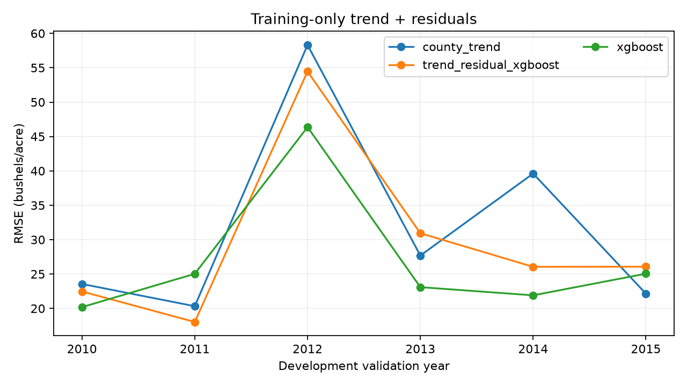

# Training-only trend and residual experiment — 6 October 2026

Question: does explicitly extrapolating a county's historical yield trend help a fixed weather/soil XGBoost learner on the six existing development folds?

Design: fit `CountyTrend` on the fold's past labels; subtract its fitted training yields; fit a cloned XGBoost preprocessing/model pipeline on those training residuals. Validation predictions add the extrapolated trend to predicted residuals. Both trend and feature imputation/state encoding are fitted only on the training fold. Residual features/settings match the original XGBoost candidate, including FYEAR; no tuning or replacement of the original deployed model.

Alternatives: predicting raw yields is the existing saved XGBoost comparator; cross-fitted residual targets would change this experiment and reduce the history available to the trend. This bounded step uses in-sample training residuals, which can shrink historical deviations and overfit, and explicitly retains that limitation. Removing FYEAR or changing trend structure is a future experiment, not an undocumented selection within this one.

Implementation plan: add a cloneable estimator; reuse the existing chronological fold runner with separate residual outputs; reject incompatible cached baseline hashes/keys/targets/scores; test extrapolation, train-only imputation and final-test poisoning; execute six new fits, inspect the figure, document actual results. Preserve all original development/final-test reports and model files byte-for-byte. Keep the two relevant saved baselines rather than training the five old candidates again.

The source remains Zenodo 7751191, CC BY 4.0 (attribution and verified archive checksum in data/README.md). The 2016–2018 final test was previously inspected and is excluded throughout. This is retrospective development analysis in recurring US counties, not a new independent test, field recommendation or Moroccan validation. Substantial AI assistance is disclosed.

## Executed development results

Six fits were executed on 6 October 2026, using the attributed real county data. All 2,934 validation county-years match the prior saved baselines: development hash, chronology/training counts, keys, targets and recomputed scores are checked before fitting. Baseline CSV/report hashes are recorded in `reports/residual_backtest.json`. The prior five-model experiment was not retrained or overwritten.

Development hashing explicitly uses UTF-8 CSV with CRLF separators and floating yield labels, preserving the original Windows-produced digest across operating systems. Raw baseline file hashes identify bytes at execution; a Git checkout's newline conversion may change those byte hashes without changing parsed predictions or recomputed metrics.

| Model | Pooled RMSE (bushels/acre) | MAE (bushels/acre) | R² |
|---|---:|---:|---:|
| County trend (saved baseline) | 34.743 | 26.197 | 0.007 |
| XGBoost raw yield (saved baseline) | 28.432 | 21.819 | 0.335 |
| County trend + XGBoost residuals | 31.997 | 23.958 | 0.158 |

The residual experiment improves on county trend alone, but has **higher pooled error than raw-yield XGBoost**. It is not promoted. The 2012 fold remains difficult (residual RMSE 54.463); neither the annual curve nor the six dependent years establish a causal explanation or robust uncertainty. Predictions for 2016–2018 were not recomputed, and the original model's SHA-256 still matches its original report.



Run from the repository after acquiring the data and installing pinned dependencies:

```bash
python -m crop_yield.cli backtest           # only if the saved baseline reports are absent/incompatible
python -m crop_yield.cli residual-backtest  # six new fits; separate outputs
python -m pytest -q
```

Outputs: `reports/residual_backtest.json`, `reports/residual_predictions.csv` and `reports/figures/residual-backtest.png`. The runner rejects stale baseline evidence instead of silently regenerating it. Headless plotting avoids a desktop GUI dependency.

Next step: audit availability/licence and feature compatibility of a genuinely new future or spatial dataset, define and freeze its evaluation protocol before inspecting labels, and keep this negative experiment. No further development tuning is justified as a replacement for independent validation.
